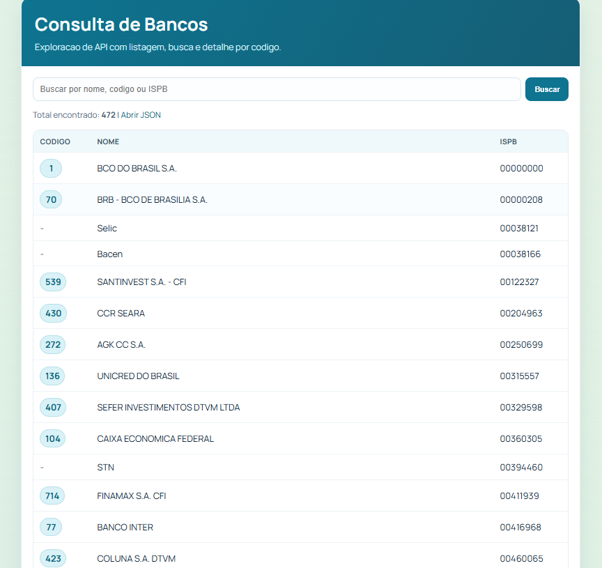

# Consulta de Bancos com PHP e BrasilAPI

Projeto em PHP para consumir a API publica de bancos da BrasilAPI e exibir:

- Listagem de bancos
- Busca por nome, codigo ou ISPB
- Pagina de detalhe por codigo
- Resposta JSON para listagem e detalhe

## Requisitos

- PHP 8.0 / superior
- Extensão cURL habilitada

## Como executar localmente

1. Abra um terminal na pasta do projeto.
2. Inicie o servidor embutido do PHP:

```bash
php -S 127.0.0.1:8000 -t .
```

3. Acesse no navegador:

- Listagem: http://127.0.0.1:8000/index.php
- Busca: http://127.0.0.1:8000/index.php?q=itau
- Detalhe por codigo: http://127.0.0.1:8000/index.php?code=1
- JSON da listagem: http://127.0.0.1:8000/index.php?format=json
- JSON do detalhe: http://127.0.0.1:8000/index.php?code=1&format=json

## Estrutura

- index.php: Controller da pagina (entrada, roteamento e resposta).
- src/BankService.php: Requisicao HTTP e regras de busca/detalhe.
- src/View.php: Funcoes de escape e normalizacao de texto.
- assets/styles.css: Estilos da interface.

## Screenshot

Visao da interface principal do projeto:


